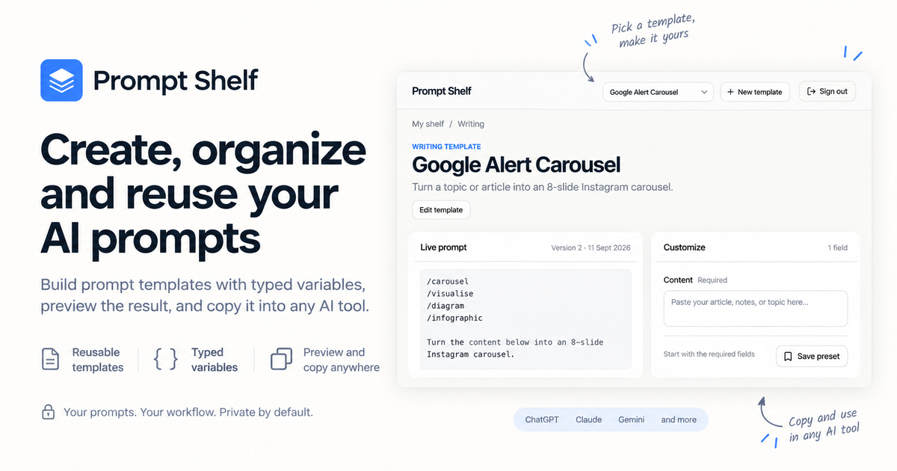

# Prompt Shelf

Build reusable AI prompt templates with typed variables, preview the compiled result, and copy it into any AI tool.

[](https://github.com/onstash/prompt-shelf/actions/workflows/verify.yml)
[](LICENSE)



## Why Prompt Shelf

Prompts often begin as useful notes and become hard-to-maintain copies. Prompt Shelf turns them into reusable workflows: define a prompt once, expose its inputs as typed fields, preview the exact compiled text, and copy it into ChatGPT, Claude, Gemini, or another AI tool.

Prompt Shelf is private by default. It does not execute prompts or store generated AI responses.

## Features

- Reusable prompt templates with immutable revisions
- Typed text, textarea, select, and number fields
- Deterministic prompt compilation and live previews
- Google sign-in with workspace-scoped ownership
- Public examples with private user templates
- Privacy-preserving product and traffic analytics

## Stack

- [TanStack Start](https://tanstack.com/start) and React 19
- [TanStack Router](https://tanstack.com/router) and React Query
- [Base UI](https://base-ui.com/) with Tailwind CSS
- [Hono](https://hono.dev/) compatibility API routes
- [Better Auth](https://www.better-auth.com/) with Google OAuth
- Cloudflare Workers, static assets, and D1

The frontend, SSR server, authentication handlers, API, and database access deploy as one Cloudflare Worker. See [ADR 0007](docs/decisions/0007-tanstack-start-cloudflare-application.md) for the rationale.

## Quick start

### Requirements

- Node.js 22
- npm
- A Cloudflare account for D1 and deployment
- Google OAuth credentials for authenticated routes

### Run locally

```bash
git clone git@github.com:onstash/prompt-shelf.git
cd prompt-shelf
npm install
npm --prefix app install
cp app/.dev.vars.example app/.dev.vars
cp app/.env.example app/.env.local
npm run db:migrate:local
npm run dev
```

Open [http://localhost:3000](http://localhost:3000).

For Google sign-in, register this exact authorized redirect URI:

```text
http://localhost:3000/api/auth/callback/google
```

Then replace the placeholder values in `app/.dev.vars`. Never commit that file.

## Commands

| Command | Purpose |
| --- | --- |
| `npm run dev` | Start the local TanStack Start server on port 3000 |
| `npm run build` | Build the client and Cloudflare Worker, then type-check |
| `npm run lint` | Run Oxlint and project-specific rules |
| `npm run format` | Format source files with Oxfmt |
| `npm run format:check` | Check formatting without changing files |
| `npm run db:migrate:local` | Apply pending migrations to local D1 |
| `npm run db:migrate:remote` | Apply pending migrations to production D1 |
| `npm run deploy` | Build and deploy through Wrangler |

Remote migrations are intentionally separate from Worker deployment. Apply an additive migration before deploying code that depends on it.

## Repository map

```text
app/
├── migrations/          D1 migrations
├── public/              Static assets
├── src/routes/          TanStack Start file routes
├── src/screens/         Route-level UI and orchestration
├── src/server/          Better Auth, Hono API, and D1 repository
└── wrangler.jsonc       Cloudflare Worker configuration
docs/decisions/          Architecture decision records
docs/releases.md         Release process
prototype/               Historical design prototypes
research/                Product and platform research
```

## Environment

Private Worker values belong in `app/.dev.vars` locally and Cloudflare secrets in production:

```text
BETTER_AUTH_SECRET
GOOGLE_CLIENT_ID
GOOGLE_CLIENT_SECRET
```

Optional public browser configuration belongs in `app/.env.local`:

```text
VITE_CLOUDFLARE_WEB_ANALYTICS_TOKEN
```

Production Google OAuth callback:

```text
https://prompt-shelf-api.hastons.workers.dev/api/auth/callback/google
```

## Architecture rules

- Server sessions are the source of user identity; never trust client-supplied user or workspace IDs.
- Every private template operation must verify workspace access.
- D1 migrations are append-only after production use; preserve migration filenames and order.
- Internal navigation uses TanStack Router rather than full-page redirects.
- Prompt execution remains external and copy-first.
- Analytics must never include prompt text, field values, generated content, emails, or stable visitor fingerprints.

More context is recorded in [`docs/decisions`](docs/decisions) and [`AGENTS.md`](AGENTS.md).

## Releases

[Release Please](https://github.com/googleapis/release-please) generates `app/CHANGELOG.md`, Semantic Version tags such as `v0.1.0`, and GitHub Releases from Conventional Commits. See [the release guide](docs/releases.md).

## Contributing

1. Create a focused branch from `main`.
2. Keep pull requests small and use a Conventional Commit title such as `feat: add template sharing`.
3. Run `npm run format:check`, `npm run lint`, and `npm run build`.
4. Explain database, authentication, privacy, or public API decisions in an ADR when they are expensive to reverse.

## License

[MIT](LICENSE)
